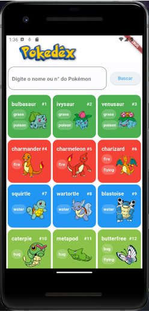
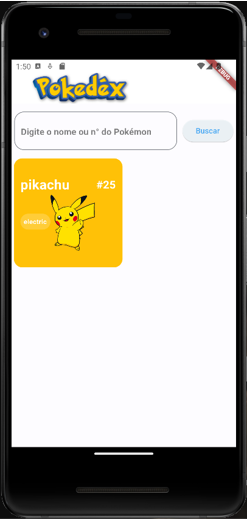
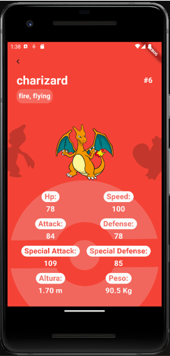

# Pokédex Flutter - PokéApi

# Descrição
Este projeto consiste na criação de um Aplicativo flutter. 
Foi criada uma pokédex, consumindo dados da API PokéApi.

Detalhes do Aplicativo:
<ul>
  <li>Tela inicial, onde é apresentado todos os pokémons da 1° Geração.</li>
  <li>Widget Search para realizar a busca de qualquer pokémon pelo seu nome ou n°.</li>
  <li>Tela details, onde é apresentado os dados de cada pokémon.</li>
  <li>Tela load, apresentada enquanto os pokémons são carregados.</li>
  <li>Tela erro, apresentada quando há algum erro ao buscar os pokémons.</li>
  <li>PokéApi, através dela alimentamos o aplicativo com os dados de cada pokémon.</li>
  <li>Separação de Telas em Widgets para melhor manutenção do código.</li>
</ul>

Ao iniciar o aplicativo, é feito uma requisição dos pokémons da 1° geração,
para cada pokémon é retornado uma nova url e assim realizamos uma nova requisição
para cada pokémon, obtendo após todos os dados dos 151 pokémons disponíveis para 
consulta do usuário.

Os pokémons são apresentados em pequenos cards, ao clicar neles é redirecionado
para a tela de details com suas informações, podendo arrastar para o lado para alterar
para o próximo pokémon ou retornar ao anterior.

Obtemos da API:
https://pokeapi.co/api/v2/pokemon/

<ul>
  <li>Imagem</li>
  <li>Nome</li>
  <li>N°</li>
  <li>Tipo</li>
  <li>Altura</li>
  <li>Peso</li>
  <li>HP</li>
  <li>Ataque</li>
  <li>Defesa</li>
  <li>Velocidade</li>
  <li>Ataque Especial</li>
  <li>Defesa Especial</li>
</ul>

E apresentamos estes dados na tela.

# Layout do Projeto

  
  
  

# Tecnologias Utilizadas

<ul>
  <li>Dart</li>
  <li>Flutter</li>
  <li>Android Studio</li>
  <li>Visual Studio Code</li>
  <li>PokéApi</li>
</ul>

# Autor
José Ricardo Chies Gonçalves

LinkedIn:
https://www.linkedin.com/in/ricardo-chies-087557216/

E-mail:
chies.dev@gmail.com
